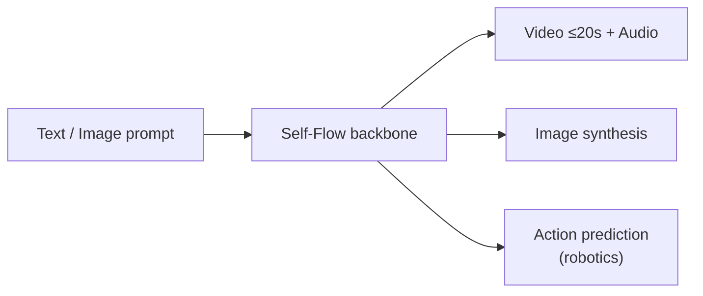

# Models — 2026-07-24

## FLUX 3: Black Forest Labs' Unified Multimodal Model 

**Source:** [Black Forest Labs blog](https://bfl.ai/blog/flux-3) · **Type:** release · **Time (UTC):** ~09:00 Jul 23

Black Forest Labs released FLUX 3, its first unified multimodal model, combining image synthesis, video generation, audio, and physical-AI action prediction within a single set of weights built on its "Self-Flow" architecture. Text-to-video runs up to 20 seconds with natively synchronized audio. Early blind evaluations show 77% preference over Runway Gen-4.5 and 93% over Luma Ray 3.2, though BFL describes these as preliminary.

**Why it matters:** BFL — known primarily for state-of-the-art still-image generation powering Adobe Photoshop and Picsart — is now directly competing with Runway, Sora, and Luma in video, while the robotics/action-prediction track ("FLUX 3 Action") marks an expansion into physical AI that none of its image-gen peers have announced.

| Track | Status | Notes |
|---|---|---|
| FLUX 3 Video | Early access (API + partner weights) | Up to 20s, native audio |
| FLUX 3 Action | Early access (research/commercial robotics partners) | Action prediction for embodied AI |
| FLUX 3 Image | Rolling out in coming weeks | — |
| FLUX 3 Dev | Planned later 2026 | Open-weight version |

---
