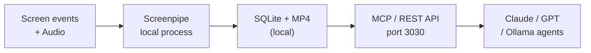

# Tools — 2026-07-24

## Echo: Open-Weight Multi-Model Orchestration at 1/3 Fable Cost 

**Source:** [Show HN thread](https://news.ycombinator.com/item?id=49026810) · **Type:** launch · **Time (UTC):** ~08:00 Jul 24

Echo is an experimental inference router that matches the benchmark performance of Anthropic's Fable 5 while reducing costs to approximately one-third by dynamically allocating tasks across a pool of open-weight models (currently including GLM-5.2 and Kimi K2.7). Per-request routing decides how much compute a prompt deserves, which models participate, and how to combine outputs. The creator reports that an oracle ensemble — knowing the optimal model in advance — substantially outperforms any single model, and Echo attempts to capture most of that gain without oracle knowledge. The Show HN thread (373 points) surfaced transparency concerns (routing decisions are not disclosed per request) and comparisons to OpenRouter Fusion and NotDiamond.

**Why it matters:** As frontier model performance saturates certain benchmarks, routing-based approaches become an attractive cost optimization layer for engineers who can tolerate slightly opaque inference paths. The comparison to existing routers (NotDiamond, Sakana Fugu) suggests the field is consolidating around ensemble inference as a product category.

---

## Screenpipe (YC S26): Local Screen Recording as Agent Memory 

**Source:** [Launch HN](https://news.ycombinator.com/item?id=49024620) · **Type:** launch · **Time (UTC):** ~09:00 Jul 24

Screenpipe (YC S26) continuously records screen events and audio locally, converting them into a searchable SQLite + MP4 database that AI agents can query via an MCP-compatible API on port 3030. Rather than recording continuous video, it captures meaningful events (app switches, clicks, typing pauses) paired with the OS accessibility tree, plus audio with Whisper/Parakeet transcription and speaker identification. All processing is local-first; PII redaction runs on-device via Apple MLX or Windows DirectML. The tool now carries a source-available license (switched from MIT), which drew community criticism at launch.

**Why it matters:** Screenpipe provides a practical implementation of persistent agent memory tied to real desktop activity, relevant as MCP-compatible memory tools become infrastructure for coding agents and personal automation workflows. The license controversy is a live risk for adoption in open-source pipelines.

---
