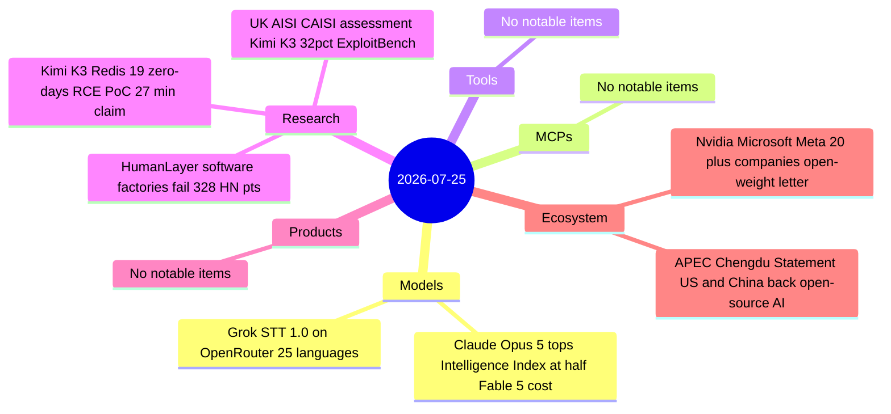

# AI Digest — 2026-07-25

> Anthropic's Claude Opus 5 launched on July 24 and immediately topped the Artificial Analysis Intelligence Index with a score of 61 — narrowly ahead of Fable 5 — while costing 20% less per task, carrying a 1M-token context window, and operating with significantly lighter safety restrictions that make it practical for security and scientific workloads that Fable 5 regularly declined. The day's second story is a coordinated industry push: Nvidia, Microsoft, Meta, IBM, Palantir, and 20+ others delivered a joint letter to U.S. policymakers arguing against "premature restrictions" on open-weight AI — a larger-company complement to the Little Tech Association's 200-startup letter the day before. On the security-research front, a researcher claims Kimi K3 autonomously found 19 Redis zero-days and built a working RCE exploit in 27 minutes; a simultaneous UK-US government assessment independently rates Kimi K3 at only 32% on ExploitBench versus 76% for leading U.S. frontier models — a finding whose interpretation is complicated by the zero-day claim landing the same day. Both threads converge on Kimi K3's open-weight release scheduled for July 27.

## Day at a glance



## Top stories

1. **Claude Opus 5: Fable 5-level intelligence at lower cost and lighter restrictions** — Scores 61 on Artificial Analysis Intelligence Index (Fable 5: 60) and leads AA-Briefcase by 146 Elo over Fable 5; safety classifiers engage 85% less frequently, enabling security and chemistry work Fable 5 declined; 1,521 HN pts. [→ details](models.md#claude-opus-5)
2. **Nvidia, Microsoft, Meta and 20+ companies urge no "premature restrictions" on open-weight AI** — Coordinated big-tech letter to U.S. policymakers a day after 200-startup Little Tech coalition; notable that Google, Amazon, OpenAI, and Anthropic did not sign; 596 HN pts. [→ details](ecosystem.md#open-weight-letter)
3. **Kimi K3 claims 19 Redis zero-days autonomously; UK-US government rates its exploit capabilities at 32%** — Two simultaneous but contradictory-looking signals from the same model, landing 48 hours before its open-weight release; 215 + 54 HN pts. [→ zero-day claim](research.md#kimi-k3-redis) · [→ UK-US assessment](research.md#uk-aisi-kimi-k3)

## By the numbers

| Category   | Items | Highlight |
|------------|------:|-----------|
| Models     |     2 | Claude Opus 5: Intelligence Index 61, 20% lower cost per task vs Fable 5 |
| MCPs       |     0 | Final 2026-07-28 spec in 3 days |
| Tools      |     0 | — |
| Research   |     3 | Kimi K3 Redis RCE PoC; UK-US ExploitBench 32%; software factories fail |
| Products   |     0 | — |
| Ecosystem  |     2 | Big-tech open-weight letter; APEC Chengdu open-source AI statement |

## Timeline (UTC)

```mermaid
timeline
  title Releases and announcements
  Jul 23 : Redis issues 7 security patches : memory-corruption flaws in 4 versions
  Jul 23-24 : Grok STT 1.0 listed on OpenRouter : 25 languages speaker diarization
  Jul 24 07:00 : UK AISI and CAISI publish Kimi K3 cyber capabilities assessment : 32pct ExploitBench
  Jul 24 09:00 : Anthropic releases Claude Opus 5 : tops AA Intelligence Index at 61
  Jul 24 12:00 : Chaofan Shou publishes Kimi K3 Redis zero-day claim : 19 flaws 27-min RCE PoC
  Jul 24 14:00 : Nvidia Microsoft Meta sign open-weight AI letter : 20 plus signatories
  Jul 24 : APEC Chengdu Statement adopted : 21 economies back open-source AI
  Jul 27 : Kimi K3 open weights scheduled : 2.8T params 1.4TB MXFP4 HuggingFace
```

## Files
- [Models](models.md)
- [MCPs](mcps.md)
- [Tools](tools.md)
- [Research](research.md)
- [Products](products.md)
- [Ecosystem](ecosystem.md)
