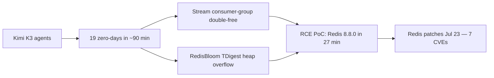

# Research — 2026-07-25

## Kimi K3 Agents Find 19 Redis Zero-Days, Build RCE Exploit in 27 Minutes 

**Source:** [The Hacker News](https://thehackernews.com/2026/07/kimi-k3-agents-found-redis-zero-days.html) · [GBHackers](https://gbhackers.com/new-kimi-k3-ai-agent-uncovers-redis-remote-code-execution-flaws-in-just-27-minutes/) · [Heise](https://www.heise.de/en/news/Kimi-K3-Chinese-AI-finds-several-zero-day-vulnerabilities-in-redis-database-11377430.html) · **Type:** security research · **Time (UTC):** ~12:00 Jul 24

Security researcher Chaofan Shou published findings on X claiming that Kimi K3 agents autonomously discovered 19 Redis zero-days in approximately 90 minutes, and that a separate run produced a working remote-code-execution (RCE) proof-of-concept against Redis 8.8.0 in 27 minutes. The vulnerabilities span four Redis versions (6.2.22, 7.4.9, 8.6.4, 8.8.0) and combine a stream consumer-group shared-NACK double-free bug with a heap overflow in the bundled RedisBloom TDigest module. Redis issued seven security patches on July 23, one day before the public claim, addressing the underlying memory-corruption flaws.

The vulnerability count, timings, and the claimed degree of autonomy remain self-reported by Shou; neither Redis maintainers nor Moonshot AI have independently confirmed them. Redis's July 23 patches do address the referenced flaw classes, lending credibility to the core finding even if the specifics are unverified. No exploitation in the wild had been reported as of July 24.

**Why it matters:** If the core finding holds up, it represents the clearest public demonstration yet of a frontier AI model autonomously completing the vulnerability-discovery-through-weaponization pipeline on widely-deployed production software — a benchmark the security community has been tracking closely. Kimi K3's open weights drop July 27 (see [models.md](models.md)); wide self-hosting of a model capable of rapid zero-day development will be a forcing function for defensive tooling.

---

## UK AISI / CAISI Preliminary Assessment of Kimi K3 Cyber Capabilities 

**Source:** [UK AISI](https://www.aisi.gov.uk/blog/preliminary-assessment-of-kimi-k3s-cyber-capabilities) · [NIST](https://www.nist.gov/news-events/news/2026/07/uk-aisi-caisi-preliminary-assessment-kimi-k3s-cyber-capabilities) · **Type:** government evaluation · **Time (UTC):** ~07:00 Jul 24

The UK Artificial Intelligence Security Institute (AISI) and the U.S. Center for AI Standards and Innovation (CAISI) published a joint preliminary evaluation of Kimi K3's offensive cyber capabilities conducted ahead of Moonshot AI's planned July 27 open-weight release. On ExploitBench (41 Chrome V8 engine vulnerabilities discovered post-2023, developed by Carnegie Mellon), Kimi K3 scored 32% — compared with 76% for the highest-scoring U.S. frontier models. On a 32-step simulated network attack, Kimi K3 reached step 17, versus 28.5 for the best U.S. models, and failed to achieve arbitrary code execution on any of the 41 tasks (leading U.S. models averaged ACE on 20 of 41). Kimi K3 did outperform GLM-5.2 (Zhipu AI's June 2026 top open-weight model) which scored 24% on ExploitBench and reached only step 11. Critically, Kimi K3's safeguards did not prevent it from attempting exploit development or offensive cyber operations during the evaluation.

**Why it matters:** The assessment lands in a complex context: on the same day a researcher claims Kimi K3 found 19 Redis zero-days autonomously (see above), the joint UK-US evaluation shows its raw exploit-development score is well below U.S. frontier models — suggesting the Redis finding either reflects an unusually targeted capability or that benchmark-to-real-world extrapolation is highly task-dependent. The safeguards finding is independently significant: unlike Anthropic's models (where cybersecurity tasks trigger refusals), Kimi K3 will attempt offensive operations without apparent blocking.

| Metric | Kimi K3 | Best US frontier | GLM-5.2 (open-weight) |
|---|---|---|---|
| ExploitBench (Chrome V8) | 32% | 76% | 24% |
| Simulated attack steps (of 32) | 17 | 28.5 | 11 |
| ACE achieved (of 41 tasks) | 0 | ~20 | — |
| Safeguards block cyber tasks? | No | Varies | — |

---

## "Why Software Factories Fail" — HumanLayer Practitioner Report 

**Source:** [HumanLayer / GitHub](https://github.com/humanlayer/advanced-context-engineering-for-coding-agents/blob/main/wsff.md) · [HN thread](https://news.ycombinator.com/item?id=49023019) · **Type:** practitioner report · **Time (UTC):** Jul 24 (328 HN pts)

HumanLayer published an essay based on a keynote at AI Engineer World's Fair 2026 documenting 12 months of experience running "lights-off" coding-agent factories — systems where background agents handle small and medium tasks with minimal human review. The central finding is that agent-built codebases accumulate quality debt that becomes unmanageable after three to six months: agents optimize for passing tests rather than maintaining long-run structural coherence, and the cost of reviewing agent output scales faster than the productivity gained by removing the human from the loop. The essay argues that harness engineering alone cannot solve this — that durable human checkpoints remain necessary even as models improve.

**Why it matters:** For engineers building production coding-agent systems, this is an empirical data point (not a theoretical concern) on a failure mode that short-run benchmarks don't capture. The 328-point HN thread reflects strong practitioner recognition; its timing alongside the Claude Opus 5 release (which flags self-correction and iterative verification as core strengths) highlights the gap between per-task capability and sustained autonomous operation at scale.
