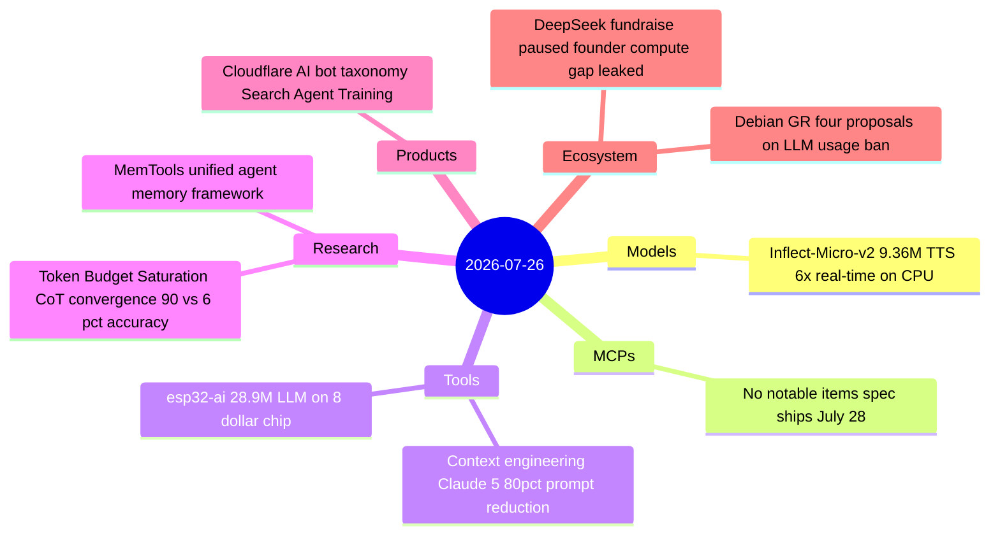

# AI Digest — 2026-07-26

> A quiet Sunday with 8 substantive items. The most-discussed story (308 HN points) is Anthropic's "Context Engineering" blog post — published Thursday alongside Claude Opus 5 — which reveals the team cut Claude Code's system prompt by more than 80% for Fable 5 and Opus 5 with no measurable eval regression, formalizing a shift from constraint-based to judgment-based prompting for Claude 5-generation models. The ecosystem story of the day is DeepSeek pausing its second funding round after founder Liang Wenfeng's investor remarks leaked, where he quantified the US-China compute gap as a 12.5:1 GPU deficit (16K Huawei chips vs. ~200K needed) and said it explains every visible performance difference. Debian's developer community opened a formal general resolution on LLM usage policy with four competing proposals, the first such vote in a major Linux distribution.

## Day at a glance



## Top stories

1. **Anthropic cuts Claude Code system prompt 80% for Claude 5 models** — The "unhobbling" approach — deleting constraints that conflict in capable models — slashes context overhead while maintaining eval parity; progressive disclosure and judgment-based instructions replace rigid rules and examples. [→ details](tools.md#context-engineering-claude5)
2. **DeepSeek halts second fundraise after leaked founder remarks** — Liang Wenfeng quantified the GPU deficit publicly for the first time: ~200K needed, 16K from Huawei, gap expected to persist for years; a Shanghai STAR IPO is in preparation. [→ details](ecosystem.md#deepseek-fundraise-pause)
3. **Debian GR on LLM usage: four proposals, discussion open** — Proposals range from a total ban to conditional allowance; the outcome will set precedent for open-source project AI contribution policy broadly. [→ details](ecosystem.md#debian-gr-llm)

## By the numbers

| Category   | Items | Highlight |
|------------|------:|-----------|
| Models     |     1 | Inflect-Micro-v2: 9.36M TTS, 66.2% human preference, 6.28× real-time CPU |
| MCPs       |     0 | 2026-07-28 spec in 2 days |
| Tools      |     2 | Context engineering: 80% Claude Code prompt reduction for Opus 5/Fable 5 |
| Research   |     2 | Token Budget Saturation: 90.3% vs 6.6% accuracy gap, AUC 0.608 early detection |
| Products   |     1 | Cloudflare: 3-tier AI bot taxonomy, Training+Agent blocked by default Sep 15 |
| Ecosystem  |     2 | DeepSeek: 16K vs 200K GPU deficit; Debian GR: 4 LLM policy proposals |

## Timeline (UTC)

```mermaid
timeline
  title Releases & announcements
  Jul 01 : Cloudflare publishes Content Independence Day : Search Agent Training bot taxonomy : Sep 15 defaults
  Jul 23 : Token Budget Saturation paper arXiv 2607.21433 : CoT convergence detection
  Jul 24 : MemTools paper arXiv 2607.21404 : unified agent memory framework
  Jul 24 14:00 : Anthropic context engineering blog : 80 pct Claude Code prompt reduction
  Jul 24 : Debian GR 2026 slash 002 discussion period opens : four LLM usage proposals
  Jul 25 10:00 : DeepSeek verbally halts second fundraise : Liang Wenfeng compute gap remarks leaked
  Jul 26 08:00 : esp32-ai on HN 174 pts : 28.9M LLM on 8 dollar ESP32-S3
  Jul 26 09:00 : Inflect-Micro-v2 on HN 114 pts : 9.36M TTS model 6.28x real-time CPU
```

## Files
- [Models](models.md)
- [MCPs](mcps.md)
- [Tools](tools.md)
- [Research](research.md)
- [Products](products.md)
- [Ecosystem](ecosystem.md)
