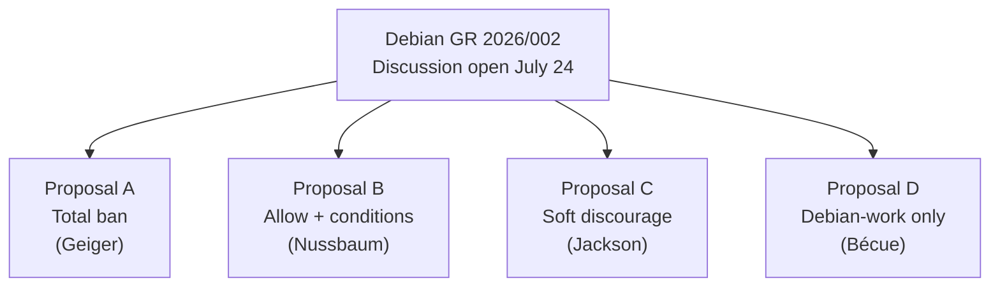

# Ecosystem — 2026-07-26

## DeepSeek halts second fundraise after founder's compute gap remarks leak 

**Source:** [Fortune](https://fortune.com/2026/07/25/deepseek-liang-wenfeng-backers-fundraising-pause-viral-posts-investors/) · [Bloomberg via US News](https://money.usnews.com/investing/news/articles/2026-07-25/deepseek-tells-prospective-investors-of-funding-pause-bloomberg-news-reports) · **Type:** funding · **Time (UTC):** 2026-07-25 ~10:00

DeepSeek verbally informed prospective investors on July 25 that it would not sign investment agreements in the coming days, pausing its second fundraising round. The trigger was a leaked account of a ~4-hour investor meeting in which founder Liang Wenfeng discussed the US-China AI gap. The key quote attributed to him: "All the differences we see — whether in talent, model performance, or applications — boil down to the disparity in computing resources."

Concrete details from the leaked transcript: DeepSeek needs approximately 200,000 high-performance GPUs but has received only 16,000 from Huawei, with supply constraints expected to persist for years. DeepSeek's pricing strategy targets recovering capex in 10 months at inference cost, no higher. The company is preparing for an IPO on Shanghai's STAR Market, potentially this year.

Background: DeepSeek's first outside round closed at ~$7 billion (¥50B) in June 2026 with Tencent, CATL, and the Chinese state AI investment fund as lead backers, at a pre-money valuation of ~$52B. The paused second round had been pointing to a ~$71B pre-money valuation (37% step-up). Reached 137 HN points.

**Why it matters:** The leaked remarks make explicit what chip export restrictions imply but rarely quantify: a 12.5:1 deficit in GPU access (16K vs. 200K needed) that Liang frames as the root cause of every visible performance gap. The fundraise pause removes an immediate capital infusion while the IPO track suggests long-term independence from private investors.

---

## Debian GR: four proposals on LLM usage open for discussion 

**Source:** [Debian General Resolution 2026/002](https://www.debian.org/vote/2026/vote_002) · [Phoronix](https://www.phoronix.com/news/Debian-GR-LLM-Usage) · **Type:** policy · **Time (UTC):** 2026-07-24 (discussion period opened)

Debian developer Matthias Geiger submitted a General Resolution on July 22 proposing a complete ban on LLM-assisted contributions to Debian. The official discussion period opened July 24 with four competing proposals:

| Proposal | Stance | Key conditions |
|----------|--------|----------------|
| **A (Geiger)** | Total ban | No LLM use for packages, web resources, docs, translations, or project communications |
| **B (Nussbaum)** | Allow with conditions | Disclosure required; legal/license compatibility check; no cloud tools for sensitive data |
| **C (Jackson)** | Soft discourage | Avoid LLMs where practical; human-only messaging to humans; mandatory disclosure |
| **D (Bécue)** | Debian-work only | AI assistance allowed for Debian-specific tasks under contributor accountability |

Arguments for a ban center on copyright ambiguity, hallucination risk, community review strain, and ethical opposition to AI training data practices. Arguments against a total ban emphasize enforceability challenges and pragmatic adoption reality. Voting period has not yet been set.

**Why it matters:** This is the first general resolution on LLM contribution policy in a major Linux distribution. Whichever proposal passes will set a precedent that other open-source projects — Fedora, FreeBSD, major upstreams — will reference when drafting their own policies. Reached 143 HN points.

---
