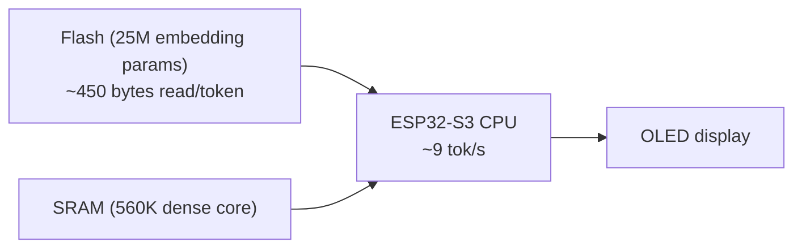

# Tools — 2026-07-26

## Anthropic: context engineering for Claude 5 — system prompt cut 80% 

**Source:** [Claude Blog — Thariq Shihipar](https://claude.com/blog/the-new-rules-of-context-engineering-for-claude-5-generation-models) · **Type:** release/guidance · **Time (UTC):** 2026-07-24 ~14:00

Anthropic published a technical blog post (written by Claude Code staff engineer Thariq Shihipar) documenting that they cut Claude Code's internal system prompt by more than 80% for Opus 5 and Fable 5 with no measurable regression on coding evals. The post introduces "context engineering" — the discipline of composing the full model context (system prompt, Skills, CLAUDE.md, memory artifacts, tool definitions) — and argues the old rules are now a liability for Claude 5-generation models.

Key shifts from the post:

- **Constraint → judgment:** Replace rigid rules ("never write multi-line comments") with intent-based guidance ("match the surrounding style"); Claude 5 models infer the right policy from context.
- **Examples → interface design:** Improve tool parameter names and enumerations rather than front-loading few-shot demonstrations.
- **Progressive disclosure:** Load context on demand via Skills, deferred tool definitions, and referenced files rather than dumping everything into the system prompt upfront.
- **Simplify redundancy:** Delete duplicate instructions across system prompt, tool descriptions, and CLAUDE.md — newer models don't need repetition.

**Why it matters:** The post reveals that the "unhobbling" philosophy (removing constraints that once prevented worst cases but now create conflicting instructions) applies directly to production prompt engineering. Engineers building with Opus 5 or Fable 5 can cut context overhead while improving task performance. Reached 308 HN points — the highest-scoring AI story on HN on July 26.

---

## esp32-ai: 28.9M-parameter LLM running on an $8 microcontroller 

**Source:** [GitHub — slvDev/esp32-ai](https://github.com/slvDev/esp32-ai) · **Type:** release · **Time (UTC):** ~08:00

A developer released esp32-ai, an open-source project that runs a 28.9M-parameter language model locally on an ESP32-S3 microcontroller (retail ~$8) with text output on a wired display. The model generates at roughly 9 tokens per second with nothing sent to a server.

The key technique is Per-Layer Embeddings (borrowed from Google's Gemma architecture): the 25M-parameter embedding table lives in flash storage rather than RAM, and only ~6 rows (~450 bytes) are read per token. The remaining ~560K dense core fits in fast RAM. The model was trained on TinyStories and produces coherent short narratives.

**Why it matters:** This demonstrates that the flash-as-parameter-store technique can fit a useful — if narrow — language model on commodity sub-$10 hardware, opening a practical path for fully offline NLP on sensors, appliances, and embedded systems without network dependency. Reached 174 HN points.

---
