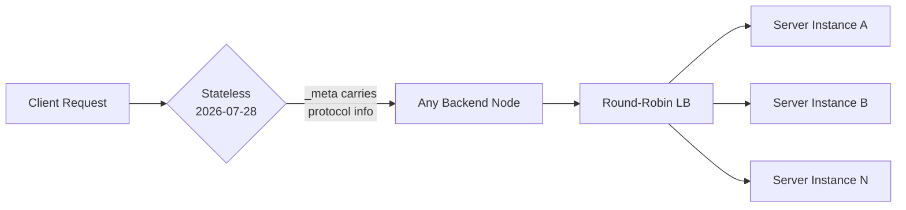

# MCPs — 2026-07-27

## MCP 2026-07-28 Beta SDKs Released 

**Source:** [blog.modelcontextprotocol.io](https://blog.modelcontextprotocol.io/posts/sdk-betas-2026-07-28/) · **Type:** release · **Time (UTC):** ~08:00

Beta builds of the Python, TypeScript, Go, and C# MCP SDKs supporting the 2026-07-28 specification release candidate are available as of today. The final specification ships tomorrow (July 28). Existing servers and clients remain unaffected until they explicitly opt into the new spec version.

The 2026-07-28 spec is the largest revision of the protocol since launch. Key changes (covered in depth in the July 24 digest):

- **Stateless core:** Session-ID header and `initialize`/`initialized` handshake removed; protocol metadata now travels in `_meta` on every request. Servers that previously required sticky routing can run behind a plain round-robin load balancer.
- **Deprecations (12-month grace period):** Roots, Sampling, and Logging are deprecated in favor of tool parameters/resource URIs, direct LLM API calls, and stderr/OpenTelemetry respectively.
- **New extensions:** MCP Apps (server-rendered UIs in sandboxed iframes) and Tasks (long-running work management, previously experimental core).
- **Auth hardening:** Six OAuth 2.0/OpenID Connect alignment changes including `iss` parameter validation and application type declarations.
- **Routing headers:** `Mcp-Method`/`Mcp-Name` allow proxies to route without body inspection; `ttlMs`/`cacheScope` enable HTTP-level caching of tool lists.

**Why it matters:** The stateless redesign removes the two biggest operational blockers for running MCP at scale — shared session stores and sticky-session routing. The formal extensions framework and 12-month deprecation policy give the ecosystem a predictable upgrade path going forward. Engineers maintaining MCP servers should pin SDK versions and test against the beta before July 28.

---
