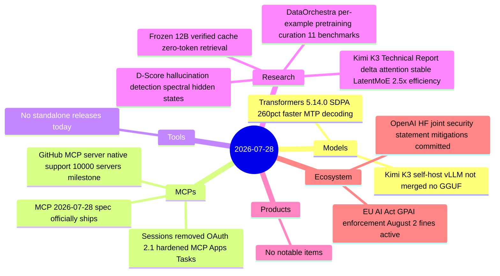

# AI Digest — 2026-07-28

> The day's defining event is the MCP 2026-07-28 specification officially shipping — the largest protocol revision since launch, removing session state entirely and mandating OAuth 2.1 auth, allowing any MCP server to run behind a plain load balancer with no sticky sessions. On the research front, Moonshot AI published the Kimi K3 technical report alongside its open weights, disclosing the novel Kimi Delta Attention architecture and Stable LatentMoE routing that explain both the model's frontier-level performance and the day-one inference tooling gap. EU AI Act GPAI enforcement powers formally activate in five days (August 2), giving the European Commission authority to demand model weights, restrict market access, and impose fines up to 3% of global turnover.

## Day at a glance



## Top stories

1. **MCP 2026-07-28 spec ships: stateless core, OAuth 2.1, extension framework** — Sessions and initialize handshake gone; every request is now self-contained; OAuth 2.1 resource indicators and issuer validation required for remote servers; MCP Apps and Tasks land as formal extensions. The 10,000+ server ecosystem has day-one support from GitHub's MCP server. [→ details](mcps.md#mcp-2026-07-28-spec)
2. **EU AI Act GPAI enforcement powers activate August 2** — From this Sunday, the Commission can request model weights, run technical evaluations, restrict EU market access, and levy fines up to 3% global turnover against GPAI model providers who fail to comply with Chapter V transparency and copyright rules. [→ details](ecosystem.md#eu-ai-act-august-2)
3. **Kimi K3 Technical Report: Kimi Delta Attention, 2.5× scaling efficiency over K2** — Published alongside open weights, the report discloses novel architecture details that explain both the frontier-level benchmark performance and why mainstream inference stacks (vLLM, SGLang, llama.cpp) don't yet support it. [→ details](research.md#kimi-k3-technical-report)

## By the numbers

| Category   | Items | Highlight |
|------------|------:|-----------|
| Models     |     2 | Kimi K3 self-host: vLLM integration pending, no GGUF; Transformers 5.14.0 up to 260% faster SDPA prefill |
| MCPs       |     2 | MCP 2026-07-28 spec ships: sessions removed, OAuth 2.1, MCP Apps + Tasks extensions |
| Tools      |     0 | — |
| Research   |     4 | K3 tech report; D-Score hallucination; DataOrchestra pretraining; Frozen 12B verified cache |
| Products   |     0 | — |
| Ecosystem  |     2 | EU AI Act GPAI enforcement Aug 2; OpenAI/HF joint security statement |

## Timeline (UTC)

```mermaid
timeline
  title Releases & announcements
  Jul 27 00:00 : Kimi K3 open weights live on HuggingFace
  Jul 27 : D-Score arxiv 2607.24586 : Frozen 12B arxiv 2607.23806
  Jul 28 00:00 : MCP 2026-07-28 spec officially published
  Jul 28 07:00 : Kimi K3 Technical Report arxiv 2607.24653
  Jul 28 08:00 : DataOrchestra arxiv 2607.24717
  Jul 28 09:00 : Transformers 5.14.0 release : MTP decoding 260pct faster SDPA prefill
  Aug 02 : EU AI Act GPAI enforcement powers activate
```

## Files
- [Models](models.md)
- [MCPs](mcps.md)
- [Tools](tools.md)
- [Research](research.md)
- [Products](products.md)
- [Ecosystem](ecosystem.md)
