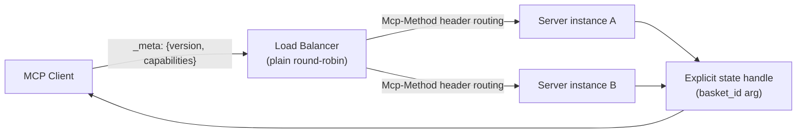

# MCPs — 2026-07-28

## MCP 2026-07-28 Specification Officially Ships 

**Source:** [Model Context Protocol Blog](https://blog.modelcontextprotocol.io/posts/2026-07-28-release-candidate/) · [The Register](https://www.theregister.com/devops/2026/07/23/model-context-protocol-prepares-to-break-with-its-stateful-past/5276722) · [WorkOS](https://workos.com/blog/mcp-2026-spec-agent-authentication) · **Type:** spec release · **Time (UTC):** 00:00 Jul 28

The Model Context Protocol 2026-07-28 specification — described by the project maintainers as the largest revision since launch — is now the canonical version. The release candidate locked on May 21 has been promoted to the official spec on its announced date.

**Architectural changes:**

- **Stateless core**: The `initialize`/`initialized` handshake is eliminated. Protocol version, client identity, and capabilities now travel in a `_meta` field on every request (mirrors Anthropic's Claude Messages API design). `Mcp-Session-Id` header is removed; servers can operate behind plain round-robin load balancers without sticky sessions or shared session stores.
- **New routing headers**: `Mcp-Method` and `Mcp-Name` are mandatory on all requests, enabling content-agnostic routing at the infrastructure layer without payload inspection.
- **OAuth 2.1 / OIDC hardening**: Remote servers must implement RFC 9728 (Protected Resource Metadata) for authorization server discovery; RFC 8707 Resource Indicators prevent token replay across servers; Client ID Metadata Documents replace Dynamic Client Registration as preferred registration; issuer validation is now required.
- **W3C Trace Context**: Standard observability headers built into the spec; tool list responses now carry TTL and cache-scope metadata.
- **Extension framework**: Features can now ship with independent release schedules outside the core spec. Two launch extensions:
  - **MCP Apps** — servers can render interactive JavaScript UIs inside clients; all UI actions route through the same audit and consent mechanisms as direct tool calls.
  - **Tasks** — promoted from experimental core feature to formal extension; structured support for long-running async workflows with handle-based lifecycle management.

**Deprecated features (12-month backward-compat window):**

| Feature | Reason |
|---------|---------|
| Sampling | Confusing semantics for server→client model calls |
| Roots | Niche file-system path hint; low adoption |
| Logging | Excessively verbose; redirect to stderr/stdio/OpenTelemetry |

**Why it matters:** Dropping sessions removes the biggest operational friction for cloud-scale deployments — session stores, sticky routing, deep-packet inspection at the gateway. Any MCP server that previously required Redis or equivalent to handle multi-instance deployments can now run statelessly. The auth hardening addresses known token-mix-up and replay attack vectors that have been a concern as more remote MCP servers handle sensitive enterprise data. The extension framework lets the ecosystem experiment with new features (like MCP Apps' server-rendered UIs) without forcing core spec churn.

**Migration:** Servers using session IDs must replace them with explicit handle arguments passed as ordinary tool parameters. The 12-month deprecation window gives existing integrations time to migrate off Sampling, Roots, and Logging.

---

## GitHub MCP Server Supports the New Spec 

**Source:** [GitHub Changelog](https://github.blog/changelog/2026-07-23-github-mcp-server-supports-the-next-mcp-specification/) · **Type:** update · **Time (UTC):** Jul 23 (spec live Jul 28)

GitHub's official MCP server (built on the Go SDK) already supports the 2026-07-28 spec as of the July 23 changelog entry, with three concrete infrastructure changes: Redis session state removed from initialization (latency reduction), deep-packet inspection replaced by `Mcp-Method`/`Mcp-Name` header routing, and the stdio transport's elicitation flow now uses separate HTTP requests per round trip. All changes are backward-compatible via the Go SDK wrapper.

**Why it matters:** GitHub's MCP server is one of the highest-traffic in the ecosystem. Early adoption validates the Go SDK's beta compatibility and provides a reference implementation for how existing servers should migrate. Combined with the 10,000+ registered MCP servers milestone, the spec's adoption baseline is strong on day one.

---
